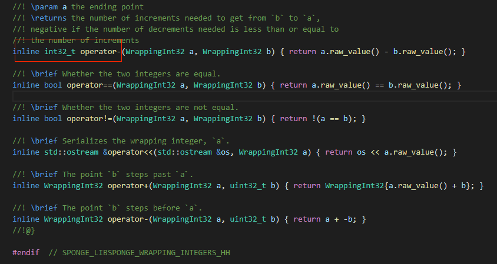
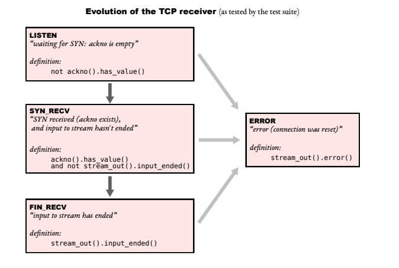

# CS144 Lab笔记

## Lab0 Warming up

前面在shell的一些小实验就不写了，自己读manual手册就能收获很多。

### class文档阅读

> std::numeric_limits<template_type>
>
> 相当于给出指定数据类型的一些限制，比如最大最小值，能表示的绝对值最小的值。
>
> std:string:data()
>
> 和c_str()差不多

### Lab 0

所需要的接口文档里面都有，唯一需要注意的就是HTTP请求最后一行之后还有一个空行。

> 注意大括号初始化可以，将变量设置为一个默认的值，比传统的只声明未初始化要好。
>
> Lab出现了几个坑，这里记录一下：
>
> * shadowing a member in initialization list, 这里主要是参数名和成员变量名最好不要相同，一般加个下划线就好了。
> * 第二个就是读取数量返回出错，这里是因为手滑return totalWrite;
> * 第三个错就是peek的时候数据不一样， 原因是我把front()当成了迭代器，实际上是begin(),怪不得我写cfront()还是显示不出来提示...
> * 最后一个错误是readLen出错，这里是因为没有仔细看readLen的定义，number of characters poped.
>
> 最后总结一下，修改之后每次测试之前需要重新make，再make check_lab0.最开始的时候，我还想直接string.resize()然后再shrink_to_fit()这种，不过确实不符合自动检测程序的标准。

### Lab 1

这里主要考虑的是capacity(新加的类和类成员byteStream是分开的)，另外刚开始写的时候，自己用的是满足条件就直接直接写到byteStream里面来，导致后面出错还蛮多的。主要是因为直接写有可能引起连环写入，而分步骤，先存离散字符串，整合以后，有符合index的就写到byteStream里面，这样只要取出最前面那一个就好了。

**发现自己还有一个情况没想的到，就是_output写进去的长度可能会比传进去的参数小，这就导致我测试文件1的最后一个样例出错了，有eof并不一定代表是end_input了，还要求写进去的长度和参数的长度一致**

capacity应该是两部分长度总共的上限，问题在于他如果有应用从byteStream里面读取了字节，head_index发生的变化怎么通知到StreamReassembler，如果没办法直接通知，就看totalRead传回来的。

#### Detail Design

* 之前有参考[这个链接](https://blog.csdn.net/kangyupl/article/details/108589594)，发现自己的思路存在一些问题，我最开始的写法是如果index符合条件就直接写入，而链接中的写法是先整合再统一写入。我这种写法的缺点就是，如果有unassemble bytes的话，写入之后可能会引发连锁写入，```index + data.size() > cache.begin()->_size```这种情况十分复杂。所以正确的做法应该是先在缓存，整合之后再写入byteStream。
* 关于```capacity```的设计，按照lab文档中的设计图，应该是byteStream加缓存的上界是```capacity```，整个capacity的起点应该是```totalRead```, 因为应用读取完数据之后，缓冲区的起点要往右移的。所以读取string的时候，右边界超过```totalRead + capacity```可以直接丢掉。

* 其他的细节主要是区间合并和unassemble bytes的更新，区间合并要讨论的情况还是比较多的，但是在图纸上画还是比较清楚的（大概四种情况）。另外一种是更行unassemble bytes的策略，这里我采用的是上面链接的策略，合并区间的函数返回合并区间的长度，每次合并之后总数减去返回值。另外合并按照排序规则，只需要向后融合，以及和向前一个节点融合（插入节点不为```cache.begin()```

### Lab 2

#### 位数转换

* 细节还是蛮多，普通情况下不用1来标识无符号数，1标识32位有符号整数，记得用```1ul```来表示。
* 最开始的时候想用加法慢慢累上去，这样再checkpoint很大的时候，效率非常低。这里直接采用位运算，分为ans大于或者小于checkpoint来讨论。
* 最后还有一个坑，就是运算可能会溢出，checkpoint和相与之后的offset是在一个连续区间里的，但是另外一个“连续的数”可能会溢出，这一部分在代码中有些，可以合并到连续区间判断的逻辑中。
* 最后还有一个坑是官方提供的运算符重载导致的...



这里减号重载返回的是有符号数字..., 真的坑。

#### 接收器部分

* vscode配置，std optional无法识别，修改c_cpp_properties.json，将cppStandard修改为c++17，gnu++14好像不支持识别optional。
* 关于window size和ack number比较好些，根据Lab1的思路来就可以了
* 有些太过于细节的还不太好处理，比如收到第一个fin之后其实被动接受方是处于fin-state one的阶段，其实应该还有处理一个对方接受到自己fin的ack之后再等待一个time wait时间才可以关闭，但是这里好像处理不了那么多，只能按照Lab文档中的三个阶段来写。



这里用一个enum class比较好，后面加逻辑的时候用switch case的时候直接jmp过去会比用多重if else效率高一点（多重if else会做各种比较运算（beq, beqz那种），switch的话会直接给case做label， jmp过去）

* 另外一个要注意的点就是要么选择不再switch语句中初始化，要么在单独初始化的地方用大括号结束那些变量的生命周期。
* ```_state == state::listen```返回的window size也和syn_recv的时候是一样的。
* syn和fin同时来的时候算直接改为fin（其实这种情况我有点不太理解，为什么第一次握手就直接接受了...)
* 还有就是syn数据包收到之后，header没带ack也是可以接受的（貌似这一节有说过只关心蓝色圈圈内的那一部分），（估计这时候应该做一下判断，如果是syn_recv状态下，不做拦截，建议直接丢掉）
* 最离谱的是第一次带syn有数据也要接收...，所以listen和syn区别好像不太大...，说好的三次握手呢？？？？
* 总体上觉得还是有点面向测试用例来写，因为测试样例中所要求的的协议和我们实际学习到的TCP协议还是有比较大的区别的。