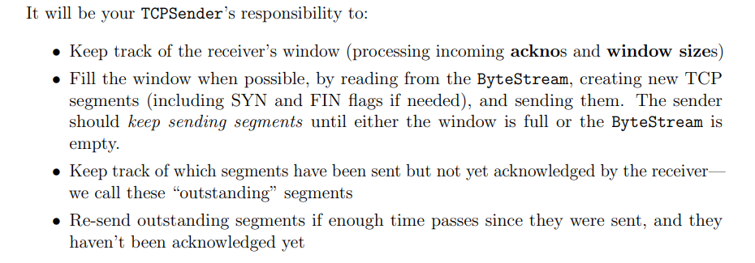
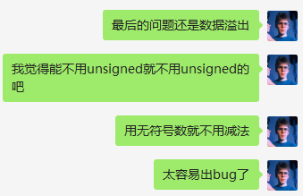
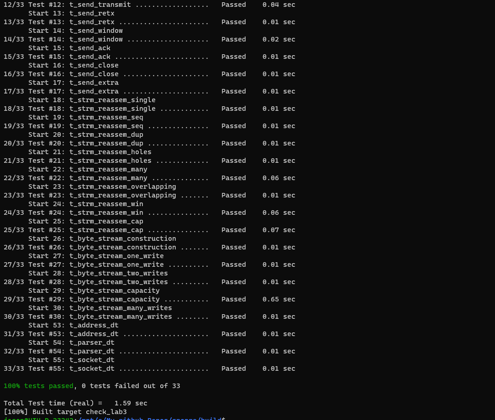

# CS144 Lab笔记

## Lab0 Warming up

前面在shell的一些小实验就不写了，自己读manual手册就能收获很多。

### class文档阅读

> std::numeric_limits<template_type>
>
> 相当于给出指定数据类型的一些限制，比如最大最小值，能表示的绝对值最小的值。
>
> std:string:data()
>
> 和c_str()差不多

### Lab 0

所需要的接口文档里面都有，唯一需要注意的就是HTTP请求最后一行之后还有一个空行。

> 注意大括号初始化可以，将变量设置为一个默认的值，比传统的只声明未初始化要好。
>
> Lab出现了几个坑，这里记录一下：
>
> * shadowing a member in initialization list, 这里主要是参数名和成员变量名最好不要相同，一般加个下划线就好了。
> * 第二个就是读取数量返回出错，这里是因为手滑return totalWrite;
> * 第三个错就是peek的时候数据不一样， 原因是我把front()当成了迭代器，实际上是begin(),怪不得我写cfront()还是显示不出来提示...
> * 最后一个错误是readLen出错，这里是因为没有仔细看readLen的定义，number of characters poped.
>
> 最后总结一下，修改之后每次测试之前需要重新make，再make check_lab0.最开始的时候，我还想直接string.resize()然后再shrink_to_fit()这种，不过确实不符合自动检测程序的标准。

### Lab 1

这里主要考虑的是capacity(新加的类和类成员byteStream是分开的)，另外刚开始写的时候，自己用的是满足条件就直接直接写到byteStream里面来，导致后面出错还蛮多的。主要是因为直接写有可能引起连环写入，而分步骤，先存离散字符串，整合以后，有符合index的就写到byteStream里面，这样只要取出最前面那一个就好了。

**发现自己还有一个情况没想的到，就是_output写进去的长度可能会比传进去的参数小，这就导致我测试文件1的最后一个样例出错了，有eof并不一定代表是end_input了，还要求写进去的长度和参数的长度一致**

capacity应该是两部分长度总共的上限，问题在于他如果有应用从byteStream里面读取了字节，head_index发生的变化怎么通知到StreamReassembler，如果没办法直接通知，就看totalRead传回来的。

#### Detail Design

* 之前有参考[这个链接](https://blog.csdn.net/kangyupl/article/details/108589594)，发现自己的思路存在一些问题，我最开始的写法是如果index符合条件就直接写入，而链接中的写法是先整合再统一写入。我这种写法的缺点就是，如果有unassemble bytes的话，写入之后可能会引发连锁写入，```index + data.size() > cache.begin()->_size```这种情况十分复杂。所以正确的做法应该是先在缓存，整合之后再写入byteStream。
* 关于```capacity```的设计，按照lab文档中的设计图，应该是byteStream加缓存的上界是```capacity```，整个capacity的起点应该是```totalRead```, 因为应用读取完数据之后，缓冲区的起点要往右移的。所以读取string的时候，右边界超过```totalRead + capacity```可以直接丢掉。

* 其他的细节主要是区间合并和unassemble bytes的更新，区间合并要讨论的情况还是比较多的，但是在图纸上画还是比较清楚的（大概四种情况）。另外一种是更行unassemble bytes的策略，这里我采用的是上面链接的策略，合并区间的函数返回合并区间的长度，每次合并之后总数减去返回值。另外合并按照排序规则，只需要向后融合，以及和向前一个节点融合（插入节点不为```cache.begin()```

### Lab 2

#### 位数转换

* 细节还是蛮多，普通情况下不用1来标识无符号数，1标识32位有符号整数，记得用```1ul```来表示。
* 最开始的时候想用加法慢慢累上去，这样再checkpoint很大的时候，效率非常低。这里直接采用位运算，分为ans大于或者小于checkpoint来讨论。
* 最后还有一个坑，就是运算可能会溢出，checkpoint和相与之后的offset是在一个连续区间里的，但是另外一个“连续的数”可能会溢出，这一部分在代码中有些，可以合并到连续区间判断的逻辑中。
* 最后还有一个坑是官方提供的运算符重载导致的...


这里减号重载返回的是有符号数字..., 真的坑。

#### 接收器部分

* vscode配置，std optional无法识别，修改c_cpp_properties.json，将cppStandard修改为c++17，gnu++14好像不支持识别optional。
* 关于window size和ack number比较好些，根据Lab1的思路来就可以了
* 有些太过于细节的还不太好处理，比如收到第一个fin之后其实被动接受方是处于fin-state one的阶段，其实应该还有处理一个对方接受到自己fin的ack之后再等待一个time wait时间才可以关闭，但是这里好像处理不了那么多，只能按照Lab文档中的三个阶段来写。


这里用一个enum class比较好，后面加逻辑的时候用switch case的时候直接jmp过去会比用多重if else效率高一点（多重if else会做各种比较运算（beq, beqz那种），switch的话会直接给case做label， jmp过去）

* 另外一个要注意的点就是要么选择不再switch语句中初始化，要么在单独初始化的地方用大括号结束那些变量的生命周期。
* ```_state == state::listen```返回的window size也和syn_recv的时候是一样的。
* syn和fin同时来的时候算直接改为fin（其实这种情况我有点不太理解，为什么第一次握手就直接接受了...)
* 还有就是syn数据包收到之后，header没带ack也是可以接受的（貌似这一节有说过只关心蓝色圈圈内的那一部分），（估计这时候应该做一下判断，如果是syn_recv状态下，不做拦截，建议直接丢掉）
* 最离谱的是第一次带syn有数据也要接收...，所以listen和syn区别好像不太大...，说好的三次握手呢？？？？
* 总体上觉得还是有点面向测试用例来写，因为测试样例中所要求的的协议和我们实际学习到的TCP协议还是有比较大的区别的。

### Lab 3

每一端都有一个reciver和sender，sender的内部构造也和reciver类似，内部的byteStream内容由sender-side的应用来写，sender来读。

sender要关心的包括： seqno, SYN, FIN, Payload

关于本个Lab3, sender具体负责的功能：



* 有一个比较重要的点就是重传时间的设计（时间太长会加大延迟，时间太短会耗费宝贵的网络容量（这里指的是单位时间传输的数据))
* 另外在窗口大小为0的时候，要当做窗口大小是1的时候来发送，这样接收方空出多余的空间可以第一时间1来通知发送方来发送新的数据。
* 这里说一点题外话，这里看文档看了好几遍，还是不太懂，感觉还是要细致的理一遍，主要不知道方法把segment组装好之后怎么发送给peer.

#### How does the sender know if a segment was lost

* Tcp sender要保留发送的集合，并且调用tick函数来查看是否经过了太长的时间,并且以此为依据决定是否重传最早发送的数据。
* 比较重要的一点就是超时的标准，这个lab的test集合会相对合理，完整的test会放在Lab4, The overall goal is to let the sender detect when segments go missing and need to be resent, in a timely manner , amount of  time to wait before resending is important.
  1. Every few milliseconds your TCPSender's tick method will be called with an argument  that tells it how many miiliseconds have elapsed since the last  time the method was called.（刚开始的时候还不太清除这个函数的作用，以为要写一些并发相关的，后面发现应该是测试样例对这个函数进行调用，比如说经过50ms，就调用一次```tick(50)```这种）
  2. 我们需要完成这样一个计时器，给定时间开始，时间经过RTO之后生效。
  3. 每次当一个TCPSegment发送的时候，如果计时器没有被启动，我们应该启动这个计时器。
  4. 当所有的外发数据都被确认之后，停止计时。
  5. 当tick被调用并且重传计时器超时的时候。
     * 重传最早的没有被全部确认的TCPSegment
     * 当window size不为0的时候，记录连续重传次数，每次重传都将RTO时间翻倍。
     * 重新将计时器时间设置为0以便开始下一轮的计时。
  6. 当收到的ackno大于现有的ackno时候，将RTO设置为初始值，如果又有往外发送的数据，重新启动计时器。将连续重传次数设置为0.

#### 测试

* 测试的时候发现自己有的地方过度解读了，就比如最开始的时候处于CLOSED状态，这时候不需要stream里面有数据也可以直接发送SYN包.
* 当stream里面没有数据的时候应该不发送空数据包，这里发送是因为被ack接收所引发，这里应该加一个条件判断，payload的长度等于0的时候直接跳出事件。
* send_window测试中有一个没有考虑到，等于0的时候有可能有FIN标志，此时应该检测完fin标志之后再对seg.length_in_sequence_space()进行检查，如果是0的话，就直接返回而不是发包。

* 第14个样例好像即使ackno < current ackno也要对window size进行更新。
* 另外一个就是fill window应该一直填充直到size不够或者没有数据写入byteStream了，这里应该加一个while循环来读取。但是我加的时候判定条件是只对窗口大小进行判断，但是如果内部字节流之中没有数据也会一直循环，按理说没有数据的时候只要判断有没有FIN标志就可以了，发送完fin标志之后，就可以重新进入下一轮switch判断
* 另外一个点是窗口大小刚好被数据写满，此时应该没有空间写入FIN标志，但是我这里原来也没有做判断。
* 最后一个问题就是空包问题，debug几次发现，空包之前没有处理，最后发现还是unsigned溢出



这里贴一个成功截图（终于调通了，面向测试样例编程2333）：



### Lab4

这个lab主要是sender和receiver合作：

Receiver职责：

	* 如果RST位置被置1了，内外的stream都要设置为error状态并且中断连接。
	* 将segment传递给TCPReceiver，来查看seqno，SYN，payload和FIN
	* 如果ACK被设置，就告诉TCPSender两个数据： ackno和window_size
	* 如果收到的segments有序列号，需要保证至少有一个segment发送用于回复，同时也可以表示ackno和window_size的变化。

Sending segments：

	* 只要TCPSender将一个segment push到了队列之中，就要发送出去，sender所做的工作包括seqno, SYN, payload, FIN.
	* 在发送之前要添加ackno和window_size到segment的头部，如果存在ackno，还要将header中的ACK flag设置为true.

时间策略：

	* 操作系统会定时调用tick函数，TCPSender需要知道经过了多久时间。
	* 当连续重传次数大于config设置的最大重传次数时，中断连接（即发送一个空包，将头部的RST标记设置为0）
	* 在适当的时候结束连接。

FAQ&corner cases

	* 本次实验最重要是处理那些lingering的连接，以及对sender和receiver的整合
	* 读取segment部分的内容在本次实验中不需要我们来操心。
	* segment发送也只需要我们将数据push到队列里面即可，测试程序会利用接口将数据发送出去。
	* 对于时间的判定也是和上一个Lab是一样的。
	* 如果收到了reset的数据包，应该将内外的ByteStream的error flag设置为1.并且随后调用TCPConnection::active函数的调用都应该返回false。
	* 发送RST数据包的情况有两种，一个是重传次数太多，第二种情况是TCPConnectin的destructor被调用。发送RST数据包和接收到RST数据包的状态应该是类似的，连接不再active并且内部ByteStream错误标记被设置为1。
	* 除了在receiver收到任何有效信息之前，几乎所有的segment都带有ACK 标记。
	* 窗口大小限制也需要考虑，比较一下_receiver的返回值和16位的限制即可

#### TIPS

* 刚开始的时候time_since_last_segment_received不知道怎么取做，因为不能调用操作系统有关时间的函数，所以在每次tick调用的时候时间加上参数即可。

* 另外一个需要注意的点是，lab3和lab4对于发包的要求还不太一样，lab3中空包是不发的，但是lab4中如果对面有包来了，至少要回一个包，即使内部的_stream.size()是0，这时候应该发送一个空包（外加一个检查，另外一个问题是我把长度检查注释掉，lab3的check里面会被阻塞，后来查清是因为while死循环了，只有segment长度为0一个出口，注释掉就死循环了）
* 还是第36个测试样例，close操作（end_input_stream）之后期待发送一个fin包，相当于四次挥手的第一步，但是我之前只设置了error state。

