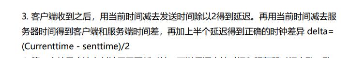

## 网络同步笔记

* 即时通信有着高要求，与传统web服务器架构相差甚远
* 除了数据同步之外，还要同步表现。网络同步 = 数据同步 + 表现同步
* MMO和FPS， 实时多端数据同步+实时多端表现同步

#### 服务端架构历史发展

最早p2p ---> cs架构 -----> 以某个host为服务器，p2p基础上的cs结构 ---> 进一步调整，把部分逻辑放在客户端进行  -----> 镜像服务器（避免单点崩溃影响到所有玩家，选择就近服务器进行通信，降低通信延迟，这种模式被web服务器采用，但是游戏服务器由于成本问题而放弃）

现在，存储和网络连接进行拆分， 奖游戏拆成多个平行世界，逻辑复杂之后按照功能去划分成网关服务器，场景服务器，非场景服务器。

之后随着游戏场景开始变得复杂，网络同步这一概念初见端倪。

### 同步概念

##### Lockstep

指的是军队中的齐步行军，冗余表示相同，冗余应将在同一时间处理相同的指令，从而保持多个CPU，内存精确的同步。

* lockstep反作弊算法：正常p2p结构对于peer传来的信息无法验证，因此Nathaniel和Brian发表论文，玩家需要现接受到所有玩家发送信息的一个预hash值之后才发送自己指令的明文信息(防止look ahead外挂)。
* 但是这种方法有点影响游戏带宽，于是又创建了SOI的概念(类似于AOI), 大概就是互不影响的两个客户端不需要等待对方的数据，按照本地时钟来推进。
* 但是锁帧还是会因为最差的游戏玩家而大大影响游戏体验，
* RTS中的LockStep，比如第K步的操作就在第K+2步来执行，第K步执行的时候检测前两部是否有操作，并且帝国时代中的每一步的动作会根据网络传输时间和机器性能来做调整
* Pipelined Lockstep protocol，不相冲突的操作可以直接执行，这种特性也成为了Lockstep的标准
* Timewrap，记录时间，发生冲突可以回滚
* Lockstep和帧同步: 一般来说逻辑和渲染都是放在一个帧中，但是运算规模较大的话就会影响游戏的流畅程度，有一些游戏（帝国时代，王者荣耀）将逻辑和渲染分开来处理，这样即使网络卡顿画面也会客户端显示也不会静止。

##### 总结

本质上的思想还是停等协议，lockstep比较适合用于局域网游戏中，并且lockstep发送指令而不是状态的原因与当时的网络带宽限制有关，玩家在每个回合做的操作也有限甚至是不操作。**但是帧同步的主要缺点还是网络条件较差的客户端会影响其他游戏玩家的体验，另外一个是很难保证在命令一致的情况下每个客户端的计算结果会一样**

#### 状态同步

* 按照雷神之锤做法，服务端接收客户端输出计算出世界的转态，将计算结果压缩之后发给客户端渲染。Quake运行时，逻辑和渲染帧率是保持一致的，由于客户端只有在接收服务端数据之后才会进行渲染，所以网络情况比较差的玩家游戏体验很糟糕。
* 以上发送快照的方式在游戏规模较大的情况下会有较大的宽带问题。所以后面只发送那些产生变化的数据，增量快照同步。进一步可以通过拆分数据，根据客户端特点来定制发送不同的数据。
* 客户端预测与回滚： 关于预测，其实就是本地先执行。要处理的情况主要是服务的结果和客户端预测发生冲突的情况，主要有两点
  * 带时间戳
  * 如果预测失败，回滚到执行失败指令之前的转态，然后把该条指令之后的转态全部执行完。
* 事件锁定和时钟同步，基于事件队列严格执行，但是需要对时间 相关信息进行记录，时钟同步采用NTP协议

这里貌似是减去，丢去和中间值偏差超过标准差的数值。

* 插值技术： 主要分为内插值和外插值，以预测数据的位置时是否再已知数据范围内来区分。

应用主要再客户端预测其他客户端的行为之时，如果预测位置和实际服务端发来的位置有差别，这是后就采用内插值来生成一个平滑的移动曲线，使得客户端表现变得没有那么突兀。

* 延迟补偿： 客户端发送到服务端的延迟是Xms，到达服务端时候，会把所有玩家的位置回退到Xms之前的位置并计算是否命中。但是这种情况如果对每个玩家都进行补偿，那之后到达的玩家
* Trialing state synchronization： 最先数据快照不进行回滚，由之后的trailing state 进行回滚，之后再复制到leading state.

* 虚幻引擎： 只将移动相关的优化方案集成到了引擎里面。主要采用的是属性复制和RPC调用这两种方式结合。

* 守望先锋：基于ECS架构带有预测回滚的增量状态同步，网络同步主要分为三个模块
  1. 移动模块：客户端记录缓冲区，用于后续与服务器纠正数据进行对比以及回滚。
  2. 技能行为模块：也是用buffer来记录玩家的输入操作，如果发现预测执行错误，就会让客户端快照回滚到错误时刻，然后把错误时刻到当前时间的所有输入都重新执行一遍
  3. 命中模块：命中判定在客户端做，

如今的状态同步主要包括增量状态同步和RPC（事件同步）看两种手段。

### 物理同步

问题：

	1. 编译器优化后的指令顺序
 	2. 约束计算的顺序
 	3. 不同版本和平台的浮点数精度问题。

Input Buffer来缓存客户端输入，减少网络延迟和抖动带来的卡顿问题。

感觉这里说的物理同步主要是位置问题。（方案一般都是状态同步+插值+预测回滚的基本框架）

技能的前摇时间来抵消RTT的延迟

UDP协议发送冗余数据