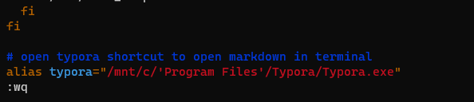

## Introducing to Algorithm

* 首先要讲的是在wsl里面用指令打开markdown文件



修改```~/.bashrc```文件，加入alias语句即可。

### Lecture 1. Thinking, Peak Finding

* 注意peak的定义，比左右都大或等于，所以等于的情况是不考虑的（取决于你对peak的定义）
* find a peak 的时间复杂度是Θ(N)，线性查找的时候
* divide and conquer, 分治算法，好像问题是peak的存在性问题， 所以可以使用二分来进行查找，哪边大就往另外一边的区间去找，如果比两边都大就找到了peak（按照讲义的定义来说好像peak一定会存在）
* 2D version of peak finding: 选中间一列，选出最大，和左右比，哪边大往哪边走，选出那一列的最大的，再和左右比较，如此往复，注意为什么最后可以保证币左右大，因为最后剩的一列开始被比较的那个数最开始的时候肯定是比左右两边的大的，而这一列的最大值是大于等于这个值的。

 