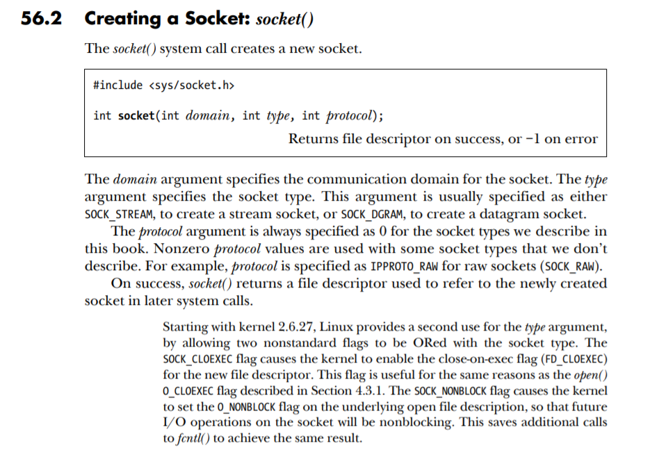

## The Server Side
* From the most basic part.Know about the type alias and macros like```__SOCKADDR_COMMON``` defined in ```sys/types.h``` and ```netinet/in.h``` header file. You should try to find where the definition is and figure it out.

* About the struct sockaddr_in

  ```c
  struct sockaddr_in
    {
      __SOCKADDR_COMMON (sin_);
      in_port_t sin_port;			/* Port number.  */
      struct in_addr sin_addr;		/* Internet address.  */
  
      /* Pad to size of `struct sockaddr'.that is 字节对齐 in Chinese.  */
      unsigned char sin_zero[sizeof (struct sockaddr)
  			   - __SOCKADDR_COMMON_SIZE
  			   - sizeof (in_port_t)
  			   - sizeof (struct in_addr)];
    };
  ```

  We could look further into definition of this macro.

  ```c
  #define	__SOCKADDR_COMMON(sa_prefix) \
    sa_family_t sa_prefix##family
  typedef unsigned short int sa_family_t
  ```

  \## here is a concatenate operator,so the first member in ```sockaddr_in``` is ```sin_family``` .

  and \\ here is a line break mark.

* ```sizeof``` operator and byte alignment

  To test this issue,I write down the following test file.

  ```c
  #include<stdio.h>
  typedef unsigned int uint32;
  typedef unsigned short uint16;
  void func(int a){
      printf("Value of a is %d\n",a);
  }
  struct in_addr{
      uint32 ip;//8 shows when this line is commented
      void (*fptr)(int);//4 shows when this line is commented
  };
  int main(void) {
      void (*fun_ptr)(int) = &func;
      fun_ptr(10);
      printf("%d",sizeof(struct in_addr));
      return 0;
  }
  ```

  1. we cant define a function in a struct in C but we can define a function pointer in its definition like the code above.
  2. Pay attention to the uses of function pointer in C.
  3. The origin size of this struct is 16 whereas after comment each line a different result appeared, **pay attention to the annotations above.**

  Let's step further to see what happens in c++ when we define a function in a struct (or class).

  ```c++
  using uint32 = unsigned int;
  class in_addr{
      unsigned short addr;
      int func(int a){
          printf("The value of a is",a);
          return a;
      }
  };
  int main() {
      cout<<sizeof(in_addr);
      return 0;
  }
  ```

  A little changes have been made,the result is,besides we can definite a function in a struct or class, the same.**And what I wanna put emphasis on is that definite a function in a class dont make the sizeof(in_addr) change!**

* ```sockaddr_in``` mentioned above represent IPV4 address while IPV6 address uses ```sockaddr_in6```

The first function call in main() is ```start(u_short *port) ```,Let's see its functionality.

* 这里说句题外话，关于extern的用法，函数在默认情况下是就是extern类型的，所以加不加extern都一样，但是extern声明variable的话就可以在不引进头文件的情况下进行文件之间的变量共享。

>start calls socket() to return a file descriptor,
>
>
>
>AF_INET or PF_INET is often passed in as the first argument,the thired argument is usually specified as 0,socket type are recorded in an enum.
>
>```c
>enum __socket_type
>{
>  SOCK_STREAM = 1,		// Sequenced, reliable, connection-based byte streams.
>#define SOCK_STREAM SOCK_STREAM
>  SOCK_DGRAM = 2,		// Connectionless, unreliable datagrams of fixed maximum length.
>#define SOCK_DGRAM SOCK_DGRAM
>  SOCK_RAW = 3,			// Raw protocol interface.
>#define SOCK_RAW SOCK_RAW
>  SOCK_RDM = 4,			// Reliably-delivered messages.
>#define SOCK_RDM SOCK_RDM
>  SOCK_SEQPACKET = 5,    // Sequenced, reliable, connection-based, datagrams of fixed maximum length.
>#define SOCK_SEQPACKET SOCK_SEQPACKET
>  SOCK_DCCP = 6,		/* Datagram Congestion Control Protocol.  */
>#define SOCK_DCCP SOCK_DCCP
>  SOCK_PACKET = 10,		/* Linux specific way of getting packets
>				   at the dev level.  For writing rarp and
>				   other similar things on the user level. */
>#define SOCK_PACKET SOCK_PACKET
>
>  /* Flags to be ORed into the type parameter of socket and socketpair and
>     used for the flags parameter of paccept.  */
>
>  SOCK_CLOEXEC = 02000000,	/* Atomically set close-on-exec flag for the
>				   new descriptor(s).  */
>#define SOCK_CLOEXEC SOCK_CLOEXEC
>  SOCK_NONBLOCK = 00004000	/* Atomically mark descriptor(s) as
>				   non-blocking.  */
>#define SOCK_NONBLOCK SOCK_NONBLOCK
>};
>```
>
>The most common type are SOCK_STREAM and SOCK_DGRAM which represent Tcp and Udp.
>
>* After calling socket(), caller checks if socket() returned -1 or not.Here's error_die() 's definition
>
>```c
>void error_die(const char *sc)
>{
> //包含于<stdio.h>,基于当前的 errno 值，在标准错误上产生一条错误消息。参考《TLPI》P49
> perror(sc); 
> exit(1);
>}
>```
>
>What perror does is just print the failure information based on the passed-in char pointer.
>
>And what happens next is :
>
>```c
> memset(&name, 0, sizeof(name));
> name.sin_family = AF_INET;//usually we use AF_INET here,PF_INET in the function call.
> //htons()，ntohs() 和 htonl()包含于<arpa/inet.h>, 参读《TLPI》P1199
> //将*port 转换成以网络字节序表示的16位整数
> name.sin_port = htons(*port);
> //INADDR_ANY是一个 IPV4通配地址的常量，包含于<netinet/in.h>
> //大多实现都将其定义成了0.0.0.0 参读《TLPI》P1187
> name.sin_addr.s_addr = htonl(INADDR_ANY);//这个宏代表全0
> 
> //bind()用于绑定地址与 socket。参读《TLPI》P1153
> //如果传进去的sockaddr结构中的 sin_port 指定为0，这时系统会选择一个临时的端口号
> if (bind(httpd, (struct sockaddr *)&name, sizeof(name)) < 0)
> 	error_die("bind");
> 
> //如果调用 bind 后端口号仍然是0，则手动调用getsockname()获取端口号
> if (*port == 0)  /* if dynamically allocating a port */
> {
>  int namelen = sizeof(name);
>  //getsockname()包含于<sys/socker.h>中，参读《TLPI》P1263
>  //调用getsockname()获取系统给 httpd 这个 socket 随机分配的端口号
>  if (getsockname(httpd, (struct sockaddr *)&name, &namelen) == -1)
>  	error_die("getsockname");
>  *port = ntohs(name.sin_port);
> }
> 
> //最初的 BSD socket 实现中，backlog 的上限是5.参读《TLPI》P1156，现在这个数字会大得多。
> if (listen(httpd, 5) < 0) 
>  error_die("listen");
> return(httpd);
>```
>
>Functions like htons,htonl,ntohs,ntohl are used for changing byte order so that data order will be independent of specific machine architecture.
>
>bind() is used to bind the socket  to the address.
>
>```c
>int bind(int sockfd, const struct sockaddr *addr, socklen_t addrlen);
>//Returns 0 on success, or –1 on error
>```
>
>Other functions are similar to bind(), all mentioned in TLPI。

**The rest is to accept the connect() socket and process the recieved data.**

