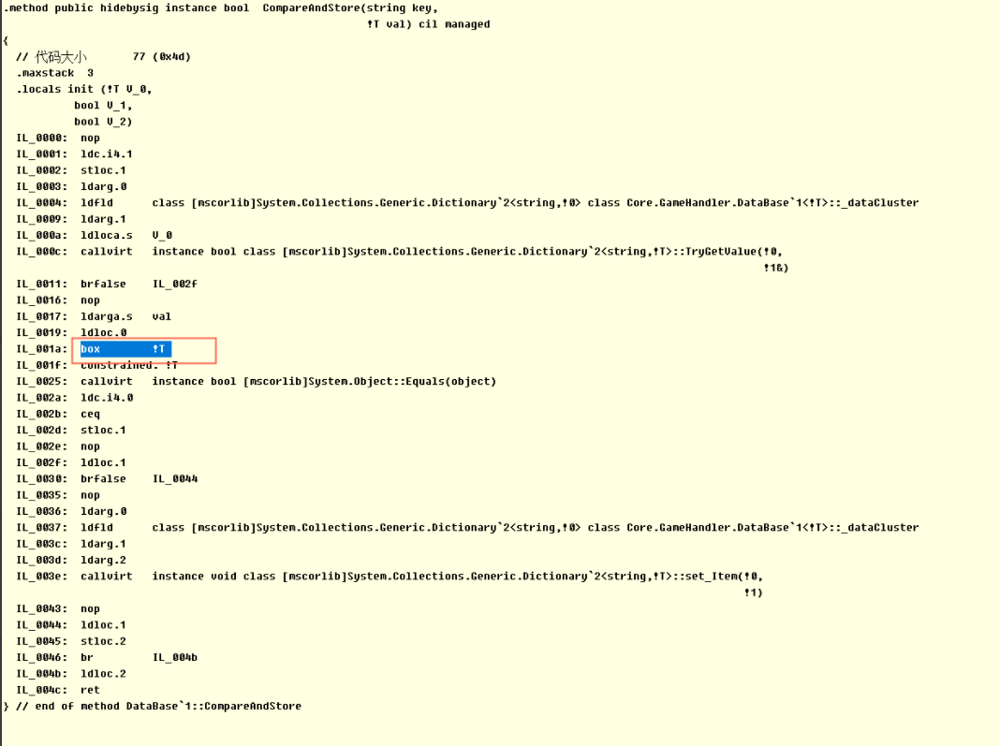
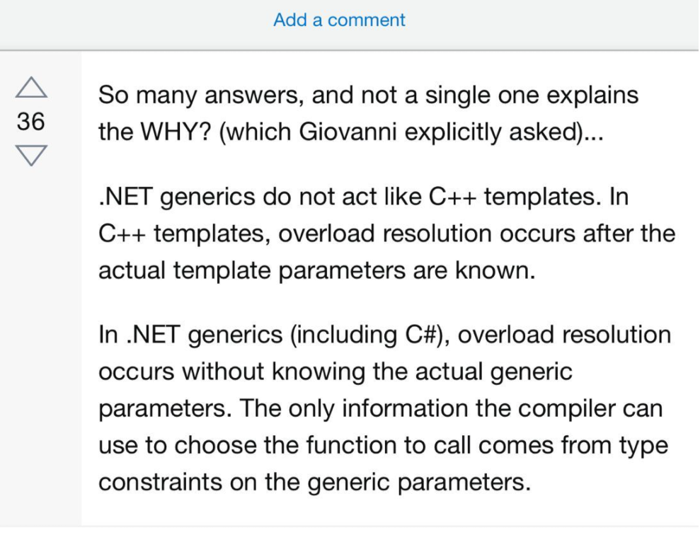

## C# 学习笔记以及U3D开发中遇到一些坑

其实只是为了点进来有一个介绍页面（逃...

#### 关于c#编译器无法运行时获取类型信息造成装箱GC

因为原有代码可能涉及一些公司隐私，这里重新写的一些示例：

```c#
public class Example<T> where T : struct{
    private Dictionary<string, T> _dataCache = new Dictionary<string, T>();
    
    public bool func1(string key, T value){
        T storedValue;
        bool isSame = false;
        if(_dataCache.TryGetValue(key, out storedValue)){
            isSame = val.Equals(storedValue)
			// do something
        }
    }
}
```

对应汇编（IL）：




存在一个问题就是，即使实际调用中的类型是int, float（c#内置已经实现了Equals方法），但是被用作泛型的时，c#编译器并不清楚该泛型实现了IEquatable接口，所以我们可以手动再加一个where限制，即可避免装箱调用Equals. 所以在泛型限制的时候需要在后面再加IEquatable<T\>限定。

```c#
public class Example<T> where T : struct, IEquatable<T>
```

stackoverflow的解释


