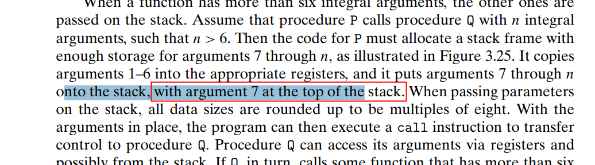

## 读书笔记

### Chapter 3 Machine Level Representation

* Control transfer，指导call和ret指令做的事情分别是把rip的内容压栈和pop即可。
* 注意参数传递，个数超过6个需要压栈，压栈的顺序需要注意。



这里的top指的是地址最低的那个，相当于说超过第6个参数之后，需要反向压栈，使得第七个参数是最后一个压栈的（每个压栈的参数都会占用8字节的空间）。

* 参数压栈结束之后才会压返回地址。还有一些细节是关于内存对齐，这一点可以去看3.33的图片
* caller-saved && callee-saved：后者使用必须要先压栈保存原来寄存器中的值。

**Combining Control and Data in Machine-Level Programs**

* 指针类型转换的一大作用就是改变指针运算的scaling
* 函数指针的例子

```c
int fun(int x, int *p);
int (*fp)(int, int *);
fp = fun;
int y = 1;
int result = fp(3, &y);
```

函数指针的值就是这个函数第一句machine code的地址。函数指针在声明的时候必须加括号，不然就成了普通的函数原型声明。

* 关于缓冲区溢出攻击，前面提到在参数数量大于6个的时候，会先压栈参数（从右边往左边压栈），最后才把返回地址压栈，相当于缓冲区溢出最先影响的是返回地址。


### 程序性能优化

> 去除多余代码，编写利于编译器优化的代码，重构代码也是很有必要的

* 预计算值，本地缓存，避免多次寻址或者计算 
* 将乘法改成移位运算，乘法运算需要利用三个CPU时钟周期，有时候可以用加法代替就尽量不要用乘法（比如计算一个像素值相邻位置的像素值，可以先进性一此乘法运算，再做四次加法运算 

* 另外开始讲了一个例子，每次循环调用一次strlen那个例子，提醒将循环边界先缓存，避免每次都去计算产生额外的时间开销

```c
// Bad Example
void lower(char *s){
    size_t i = 0;
    for(i = 0; i < strlen(s); ++i)
        if(s[i] >= 'A' && s[i] <= 'Z')
            s[i] -= ('A' - 'a');
}
```

编译器不会对这种情况进行预先计算的编译优化，c的每个文件都是独立编译的，编译器是不确定到底是用哪一个版本的strlen

* Memory Matters

多用缓存，不要直接使用变量或者数组地址，这样每次操作都会在寄存器和内存之间移动数据，时间开销会非常大。

